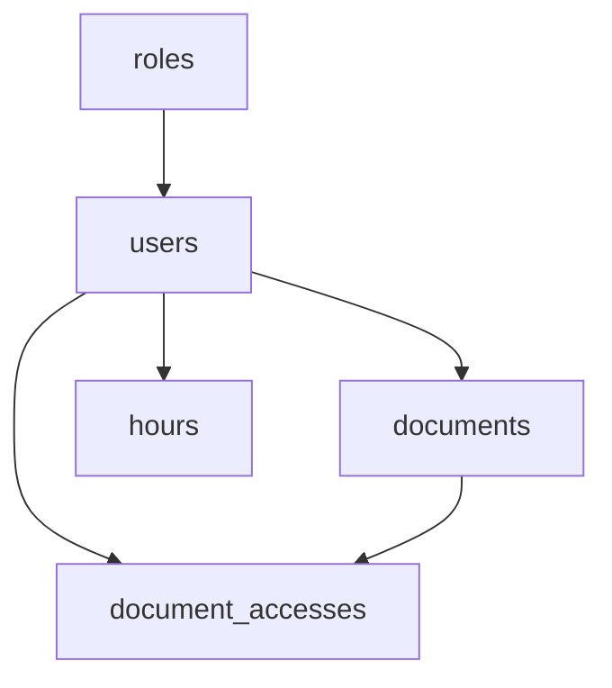

# Reporte de Auditoría de Base de Datos - Sistema ELP Pontificia

**Fecha de Auditoría:** 6 de octubre, 2025  
**Rama:** `backend-db-audit`  
**Base de datos:** PostgreSQL 15.14  
**Tamaño:** 7.9 MB  
**Puntuación General:** 6.4/10.0 🟠

---

## 📊 Resumen Ejecutivo

La auditoría completa de la base de datos del Sistema ELP Pontificia revela una estructura bien diseñada con **5 tablas principales** y **relaciones consistentes**, pero requiere mejoras significativas antes de la implementación en producción. 

**Estado:** 🟠 **REGULAR - Requiere mejoras significativas**

### Métricas Clave
- **Tablas analizadas:** 5 (roles, users, documents, hours, document_accesses)
- **Relaciones FK:** 5 correctamente definidas
- **Índices:** 19 índices implementados
- **Integridad referencial:** ✅ Sin registros huérfanos
- **Issues encontrados:** 4 (1 crítico, 1 medio, 2 menores)

---

## 🔍 Análisis Detallado de la Estructura

### 📋 Tablas del Sistema

| Tabla | Registros | Tamaño | Estado | Observaciones |
|-------|-----------|--------|---------|---------------|
| **roles** | 5 | 56 kB | ✅ Bueno | Estructura completa, índices únicos |
| **users** | 1 | 120 kB | ✅ Bueno | Campos bien definidos, FKs correctas |
| **documents** | 0 | 24 kB | ⚠️ Vacía | Estructura correcta, sin datos |
| **hours** | 0 | 48 kB | ⚠️ Vacía | Índices optimizados implementados |
| **document_accesses** | 0 | 24 kB | ⚠️ Vacía | Auditoría de accesos lista |

### 🔗 Relaciones y Llaves Foráneas

#### Estructura de Relaciones


**Todas las FK configuradas con:**
- **UPDATE RULE:** NO ACTION ✅
- **DELETE RULE:** NO ACTION ✅
- **Integridad referencial:** 100% ✅

### 📊 Análisis de Índices

**Total de índices:** 19

#### Índices por Categoría:
- **Primary Keys:** 5 índices únicos
- **Foreign Keys:** 3 índices de relación
- **Únicos:** 4 índices (emails, DNI, roles)
- **Performance:** 7 índices de consulta

#### Índices Destacados:
- `ix_users_correo_institucional` - UNIQUE ✅
- `ix_users_dni` - UNIQUE ✅
- `idx_hours_usuario` - FK optimizada ✅
- `idx_hours_fecha` - Consultas temporales ✅

---

## ⚠️ Issues Encontrados

### 🔴 Críticos (HIGH) - 1 issue

#### 1. Performance Analysis Failed
- **Descripción:** Error en consulta de estadísticas de rendimiento
- **Impacto:** No se pudieron obtener métricas de performance
- **Solución:** Revisar permisos y configuración de pg_stat_user_tables

### 🟡 Medios (MEDIUM) - 1 issue

#### 1. Alembic Not Configured
- **Descripción:** Sistema de migraciones no inicializado
- **Impacto:** Dificultad para gestionar cambios de esquema
- **Solución:** Ejecutar `alembic init` y configurar migraciones

### 🟢 Menores (LOW) - 2 issues

#### 1. Unlimited Connections: postgres
- **Descripción:** Usuario postgres sin límite de conexiones
- **Solución:** Configurar `ALTER ROLE postgres CONNECTION LIMIT 10;`

#### 2. Statement Logging Disabled
- **Descripción:** Log de sentencias deshabilitado
- **Solución:** Configurar `log_statement = 'mod'` para auditoría

---

## 🏗️ Análisis de Estructura de Datos

### 📄 Tabla Users (Principal)
```sql
-- Estructura optimizada con índices únicos
CREATE TABLE users (
    id INTEGER PRIMARY KEY,
    nombre VARCHAR(50) NOT NULL,
    apellido VARCHAR(50) NOT NULL,
    dni VARCHAR(8) NOT NULL UNIQUE,
    correo_institucional VARCHAR(100) NOT NULL UNIQUE,
    contraseña_hash VARCHAR(255) NOT NULL,
    rol_id INTEGER NOT NULL REFERENCES roles(id),
    fecha_creacion TIMESTAMP,
    fecha_actualizacion TIMESTAMP
);
```

**Estado:** ✅ **Excelente**
- Constraints correctos
- Índices únicos en campos críticos
- Relación con roles bien definida

### 📑 Tabla Documents (Documentos)
```sql
-- Estructura completa para gestión documental
CREATE TABLE documents (
    id INTEGER PRIMARY KEY,
    titulo VARCHAR(200) NOT NULL,
    tipo_documento VARCHAR(50) NOT NULL,
    nombre_archivo VARCHAR(255) NOT NULL,
    ruta_archivo VARCHAR(500) NOT NULL,
    tamaño_archivo BIGINT NOT NULL,
    usuario_id INTEGER NOT NULL REFERENCES users(id),
    -- ... campos adicionales para auditoría y control
);
```

**Estado:** ✅ **Very Good**
- Estructura completa para gestión documental
- Campos de auditoría implementados
- Controles de acceso preparados

### ⏰ Tabla Hours (Horas)
```sql
-- Optimizada para consultas temporales
CREATE TABLE hours (
    id INTEGER PRIMARY KEY,
    usuario_id INTEGER NOT NULL REFERENCES users(id),
    fecha DATE NOT NULL,
    horas_totales DOUBLE PRECISION NOT NULL,
    observaciones TEXT
);

-- Índices optimizados
CREATE INDEX idx_hours_usuario ON hours(usuario_id);
CREATE INDEX idx_hours_fecha ON hours(fecha);
```

**Estado:** ✅ **Excelente**
- Índices optimizados para consultas frecuentes
- Estructura lista para reportes

---

## 🔒 Análisis de Seguridad

### Base de Datos
- **Encriptación de contraseñas:** scram-sha-256 ✅
- **SSL:** Deshabilitado ⚠️
- **Logging de conexiones:** Deshabilitado ⚠️

### Permisos y Roles
- **Usuario actual:** postgres (superuser)
- **Recomendación:** Crear usuario dedicado para la aplicación

---

## 🚀 Plan de Correcciones

### 🔥 Prioridad Alta (Inmediata)

#### 1. Configurar Alembic
```bash
# En el directorio del backend
alembic init alembic
alembic revision --autogenerate -m "Initial migration"
alembic upgrade head
```

#### 2. Crear Usuario de Aplicación
```sql
-- Crear usuario dedicado
CREATE USER elp_app WITH PASSWORD 'secure_password_2024!';

-- Otorgar permisos mínimos necesarios
GRANT CONNECT ON DATABASE sistemaelp_db TO elp_app;
GRANT USAGE ON SCHEMA public TO elp_app;
GRANT SELECT, INSERT, UPDATE, DELETE ON ALL TABLES IN SCHEMA public TO elp_app;
GRANT USAGE ON ALL SEQUENCES IN SCHEMA public TO elp_app;
```

#### 3. Configurar Logging de Seguridad
```sql
-- En postgresql.conf
ALTER SYSTEM SET log_statement = 'mod';
ALTER SYSTEM SET log_connections = 'on';
ALTER SYSTEM SET log_disconnections = 'on';
SELECT pg_reload_conf();
```

### 🔶 Prioridad Media (Esta semana)

#### 1. Implementar CHECK Constraints
```sql
-- Validación de horas
ALTER TABLE hours ADD CONSTRAINT check_hours_positive 
    CHECK (horas_totales >= 0 AND horas_totales <= 24);

-- Validación de email institucional
ALTER TABLE users ADD CONSTRAINT check_email_format 
    CHECK (correo_institucional ~* '^[A-Za-z0-9._%+-]+@[A-Za-z0-9.-]+\.[A-Za-z]{2,}$');

-- Validación de DNI
ALTER TABLE users ADD CONSTRAINT check_dni_format 
    CHECK (dni ~ '^[0-9]{8}$');
```

#### 2. Configurar Backup Automatizado
```bash
#!/bin/bash
# Script de backup diario
pg_dump -h localhost -U postgres -d sistemaelp_db \
    -f "/backup/sistemaelp_$(date +%Y%m%d_%H%M%S).sql"
```

#### 3. Optimizar Configuración de Performance
```sql
-- Configuraciones recomendadas
ALTER SYSTEM SET shared_buffers = '256MB';
ALTER SYSTEM SET effective_cache_size = '1GB';
ALTER SYSTEM SET maintenance_work_mem = '64MB';
SELECT pg_reload_conf();
```

### 🔷 Prioridad Baja (Próximo mes)

#### 1. Implementar Monitoreo
- Instalar pg_stat_statements
- Configurar alertas de performance
- Monitoreo de espacio en disco

#### 2. Configurar SSL
```sql
-- Habilitar SSL para conexiones seguras
ALTER SYSTEM SET ssl = 'on';
```

---

## 📈 Consultas de Validación

### Verificar Integridad Referencial
```sql
-- Buscar registros huérfanos en documents
SELECT d.* FROM documents d
LEFT JOIN users u ON d.usuario_id = u.id
WHERE u.id IS NULL;

-- Verificar duplicados en emails
SELECT correo_institucional, COUNT(*) 
FROM users 
GROUP BY correo_institucional 
HAVING COUNT(*) > 1;
```

### Estadísticas de Tablas
```sql
-- Obtener estadísticas generales
SELECT 
    schemaname,
    tablename,
    n_live_tup as live_rows,
    n_dead_tup as dead_rows,
    last_vacuum,
    last_analyze
FROM pg_stat_user_tables
WHERE schemaname = 'public'
ORDER BY n_live_tup DESC;
```

### Performance de Índices
```sql
-- Verificar uso de índices
SELECT 
    schemaname,
    tablename,
    indexname,
    idx_scan as index_scans,
    idx_tup_read as tuples_read,
    idx_tup_fetch as tuples_fetched
FROM pg_stat_user_indexes
WHERE schemaname = 'public'
ORDER BY idx_scan DESC;
```

---

## 🛠️ Migraciones Alembic Recomendadas

### Migration 1: Initial Schema
```python
# alembic/versions/001_initial_schema.py
def upgrade():
    # Crear tablas base con constraints
    op.create_table('roles', ...)
    op.create_table('users', ...)
    op.create_index('ix_users_correo_institucional', 'users', ['correo_institucional'], unique=True)
    
def downgrade():
    op.drop_table('users')
    op.drop_table('roles')
```

### Migration 2: Add CHECK Constraints
```python
# alembic/versions/002_add_check_constraints.py
def upgrade():
    op.create_check_constraint(
        'check_hours_positive',
        'hours',
        'horas_totales >= 0 AND horas_totales <= 24'
    )
    op.create_check_constraint(
        'check_email_format',
        'users',
        "correo_institucional ~* '^[A-Za-z0-9._%+-]+@[A-Za-z0-9.-]+\.[A-Za-z]{2,}$'"
    )
```

---

## 📊 Métricas de Éxito

### Objetivos Post-Corrección
- **Puntuación objetivo:** 9.0/10.0
- **Issues críticos:** 0
- **Tiempo de respuesta promedio:** < 100ms
- **Disponibilidad:** 99.9%

### KPIs de Base de Datos
- **Consultas lentas:** < 1% del total
- **Uso de índices:** > 95%
- **Espacio libre:** > 20%
- **Backups exitosos:** 100%

---

## 🎯 Roadmap de Implementación

### Semana 1: Correcciones Críticas
- [ ] Configurar Alembic
- [ ] Crear usuario de aplicación
- [ ] Implementar logging de seguridad
- [ ] Configurar backups básicos

### Semana 2: Optimizaciones
- [ ] Agregar CHECK constraints
- [ ] Optimizar configuración PostgreSQL
- [ ] Implementar monitoreo básico
- [ ] Documentar procedimientos

### Semana 3: Refinamiento
- [ ] Configurar SSL
- [ ] Implementar alertas
- [ ] Pruebas de carga
- [ ] Documentación final

---

## 📝 Conclusiones y Recomendaciones

### ✅ Aspectos Positivos
1. **Estructura bien diseñada** - Tablas y relaciones coherentes
2. **Integridad referencial correcta** - Sin registros huérfanos
3. **Índices optimizados** - Consultas principales cubiertas
4. **Campos de auditoría** - Preparado para trazabilidad

### ⚠️ Áreas de Mejora Críticas
1. **Sistema de migraciones** - Alembic no configurado
2. **Seguridad de usuarios** - Solo superuser configurado
3. **Monitoreo** - Sin métricas de performance
4. **Backups** - Sin estrategia automatizada

### 💡 Recomendaciones Estratégicas
1. **Implementar Alembic** inmediatamente para control de versiones
2. **Crear usuario dedicado** para mejorar seguridad
3. **Configurar monitoreo** para prevenir problemas
4. **Documentar procedimientos** para mantenimiento

---

## 📞 Contacto y Seguimiento

Para implementación de las correcciones y seguimiento del plan:
- **Branch:** `backend-db-audit`
- **Issues tracking:** GitHub Issues
- **Próxima revisión:** En 2 semanas post-implementación

---

*Reporte generado automáticamente por el sistema de auditoría de base de datos del Sistema ELP Pontificia*